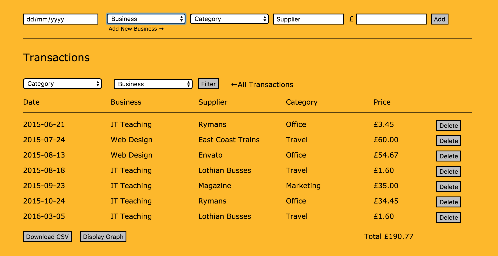

**Do My Tax Return**

A website written in Ruby and SQL using Sinatra to enable freelancers to prepare business expenses ready for completing self assessment tax returns. Records are filterable by category and users are able to download a CSV file of their accounts.

Usage: clone and run ruby controller.rb